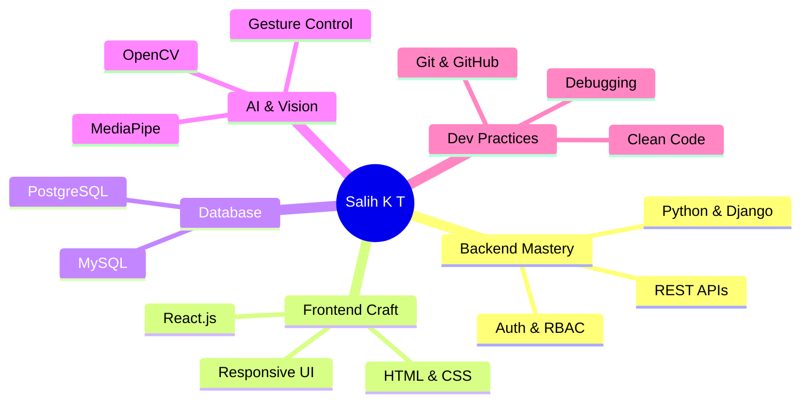

<div align="center">
  

  <p>
    
  </p>

  <!-- Social Badges -->
  <p>
    <a href="https://linkedin.com/in/your-linkedin"></a>
    <a href="mailto:salihkt8129@gmail.com"></a>
    <a href="https://github.com/YOUR_GITHUB_USERNAME"></a>
  </p>

  <!-- Views & Followers -->
  <p>
    
    
    
  </p>
</div>

---


## 🚀 About Me

```python
class MuhammedSalih:
    def __init__(self):
        self.name       = "Muhammed Salih K T"
        self.location   = "Kottakkal, Kerala, India 🇮🇳"
        self.role       = "Software Engineer"
        self.education  = "B.Tech CSE – Royal College of Engineering"
        self.passion    = ["Backend Dev", "Full-Stack", "AI/CV", "Clean Code"]
        self.mission    = "Building efficient software that actually works"

    def skills(self):
        return {
            "Backend"   : ["Python", "Django", "Django REST Framework"],
            "Frontend"  : ["React.js", "HTML", "CSS", "JavaScript"],
            "Databases" : ["PostgreSQL", "MySQL"],
            "CV / AI"   : ["OpenCV", "MediaPipe"],
            "Tools"     : ["Git", "GitHub", "REST APIs"]
        }

    def currently(self):
        return "Interning @ Febno Technologies 🏢"

    def mantra(self):
        return "Code smart. Build clean. Ship fast. 🚀"

dev = MuhammedSalih()
print(dev.mantra())
```

<br clear="right"/>

### 🎯 What I'm Working On
- ⚙️ Building production-ready **RESTful APIs** with Django REST Framework
- 🔐 Implementing **auth systems** and role-based access control
- ⚛️ Crafting responsive **React UIs** for full-stack apps
- 🖱️ Experimenting with **AI & Computer Vision** projects
- 🌱 Levelling up on cloud deployments and DevOps

---

## 🛠️ Tech Stack & Tools

<div align="center">

### Languages & Frameworks


### Databases & Tools


### AI / Computer Vision

&nbsp;


</div>

---

## 💼 Professional Experience

### 🏢 Software Engineer Intern — Febno Technologies *(Aug 2025 – Feb 2026)*
> 📍 Kakkanchery, Kerala

- 🔧 Developed and maintained **RESTful APIs** using Python, Django & Django REST Framework
- 🔐 Built backend logic for **authentication**, CRUD operations & role-based access control
- 🗄️ Integrated **PostgreSQL** for efficient data storage and retrieval
- ⚛️ Built responsive & interactive **user interfaces** using React, HTML and CSS
- 🧹 Maintained clean code standards; version control with **Git & GitHub**

---

## 🚀 Projects

### 🖱️ AI Virtual Mouse — *Computer Vision Project*
> **Tech:** Python · OpenCV · MediaPipe

> Eliminate the physical mouse — control your computer with hand gestures in real time.

- 🤚 Real-time **hand landmark detection** using MediaPipe & OpenCV
- 🖱️ Finger gestures mapped to **cursor movement, left-click & right-click**
- ⚡ Optimized detection pipeline for **low-latency & high accuracy**
- 🔬 A step toward touchless, accessible **human-computer interaction**

---


## 🚀 Skills Matrix

<div align="center">



</div>


## 🤝 Let's Connect!

<div align="center">

| Platform | Link | Purpose |
|----------|------|---------|
| 💼 LinkedIn | [muhammed-salih-k-t](https://linkedin.com/in/your-linkedin) | Professional & Networking |
| 📧 Email | [salihkt8129@gmail.com](mailto:salihkt8129@gmail.com) | Projects & Opportunities |
| 🐙 GitHub | [YOUR_GITHUB_USERNAME](https://github.com/YOUR_GITHUB_USERNAME) | Code & Collaboration |

</div>

---

## 📌 Quick Links

<div align="center">

[](https://drive.google.com/your-resume-link)
[](https://linkedin.com/in/your-linkedin)
[](mailto:salihkt8129@gmail.com)

</div>

---

<div align="center">
  

  <p>
    
  </p>

  <p>
    
    <i><b>Always open to connecting with fellow builders!</b> Drop me a Hi anytime 😊</i>
  </p>

  <sub>✨ <b>Crafted with ❤️, ☕ and a love for clean code by Muhammed Salih K T</b> ✨</sub>
</div>
